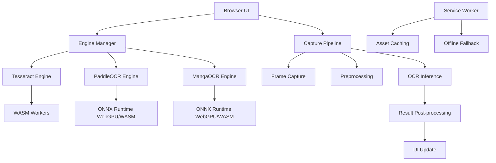

# PersonalOCR Audit Report
**Version:** 3.8.5 Gold Certified  
**Date:** 2026-04-21  
**Auditor:** Roo (AI Architect)

## Overview
This audit examines the personalOCR codebase for fragility, race conditions, memory leaks, error‑handling gaps, and other defects that could impact stability in a production environment. The application is fully functional but exhibits several “sharp edges” that could lead to crashes or inconsistent UI under edge‑case loads.

The audit follows a defensive‑coding philosophy: each proposed fix is minimal, reversible, and focused on adding safety nets without altering core behavior.

## System Architecture (High‑Level)

## Issues & Recommended Fixes

### 1. Engine Manager Race Conditions
| File | Line | Issue | Suggested Fix | Priority |
|------|------|-------|---------------|----------|
| `js/core/engine_manager.js` | ~275 | `currentEngineId` is set before the engine load completes. If the load fails, the UI may already reflect the new engine while the active instance remains the old one. | Move `currentEngineId = id` after successful load (or keep a temporary “pending” flag). Keep the early assignment for progress reporting but add a rollback guard. | High |
| `js/core/engine_manager.js` | ~258 | `switchEngine` does not validate `registryEntry` before dereferencing. | Add a null‑check and early return with a warning. | Medium |
| `js/core/engine_manager.js` | ~46 | `evictOtherEngines` deletes metadata but does not set `meta.instance = null`. | Add `meta.instance = null` after disposal (already proposed in bug_fix_plan). | Medium |
| `js/core/engine_manager.js` | ~109 | `getOrLoadEngine` lacks validation of the `id` parameter. | Add a guard `if (!id || typeof id !== 'string')`. | Low |

### 2. Capture Pipeline Generation‑Check Race
| File | Line | Issue | Suggested Fix | Priority |
|------|------|-------|---------------|----------|
| `js/core/capture_pipeline.js` | 86 | Multi‑pass Tesseract branch checks generation **after** the first OCR pass, allowing a stale capture to consume CPU. | Move the generation check **before** the first `runOCR` call (as outlined in bug_fix_plan). | High |
| `js/core/capture_pipeline.js` | 136–139 | Generic pipeline branch may leak canvases if an error occurs before the generation‑check loop. | Ensure `canvases.forEach(c => { c.width = 0; c.height = 0; })` is called in a `finally` block that covers the whole processing block. | Medium |
| `js/core/capture_pipeline.js` | 256–292 | `preprocessForEngine` may return an empty array; callers assume at least one canvas. | Validate `canvases.length` and fall back to a cloned raw canvas. | Low |

### 3. UI Controller Status Flicker & Timer Leak
| File | Line | Issue | Suggested Fix | Priority |
|------|------|-------|---------------|----------|
| `js/ui/ui_controller.js` | 64 | READY status updates are dropped while a settle timer is pending, potentially leaving the UI stale. | Instead of dropping, reset the timer with the new status text. | Medium |
| `js/ui/ui_controller.js` | – | The settle timer is never cleared on page unload (minor memory leak). | Add `window.addEventListener('beforeunload', () => clearTimeout(statusSettleTimer))`. | Low |

### 4. Service‑Worker Cache & Fetch Handler
| File | Line | Issue | Suggested Fix | Priority |
|------|------|-------|---------------|----------|
| `service‑worker.js` | 77–90 | Integrity check compares normalized paths (without query strings) against cached keys that include query strings, causing false “missing” warnings. | Normalize both sides with the same function, or strip query strings from `ASSETS` before `cache.addAll`. | Medium |
| `service‑worker.js` | 148–162 | Fetch handler may return `null` when both network and cache fail, causing a `TypeError` in the browser. | Always return a valid `Response` (e.g., a plain‑text offline message). | High |
| `service‑worker.js` | 136–146 | Caching logic `if (!isAsset || !isHtml)` may incorrectly cache HTML responses for asset requests. | Refactor to `if (!(isAsset && isHtml))` (the current logic may already be correct but is hard to reason about). | Low |

### 5. Settings Inconsistency
| File | Line | Issue | Suggested Fix | Priority |
|------|------|-------|---------------|----------|
| `settings.js` | 194–195 | `applyUIToSettings` looks for `#heavy‑warning‑checkbox` while the UI uses `#banner‑nocall‑checkbox`. | Align the ID with the actual element or use a data attribute. | Low |
| `settings.js` | 101–105 | `normalizeBoolean` treats an empty string as the default; this could hide a corrupted stored value. | Keep current behavior; add a comment about localStorage corruption. | Low |

### 6. Global Variable Initialization
| File | Line | Issue | Suggested Fix | Priority |
|------|------|-------|---------------|----------|
| `app.js` | 170–172 | Global state variables (`window.isProcessing`, etc.) are exposed early, but dependent modules could theoretically load before the variables are assigned (unlikely with ES modules). | Keep as is; add a defensive null‑check in critical paths (already present in most places). | Low |

### 7. Engine‑Specific Loading Edge Cases
| File | Line | Issue | Suggested Fix | Priority |
|------|------|-------|---------------|----------|
| `js/tesseract/tesseract_engine.js` | 50 | `checkAssets()` is called but its result is ignored; failure does not prevent load. | Make asset check non‑blocking but log a warning. | Low |
| `js/paddle/paddle_engine.js` | 89–100 | `loadPromise` is not cleared on load failure, causing subsequent calls to hang. | Ensure `loadPromise = null` in the `catch` block. | Medium |

## Summary of Critical Fixes (Week 1)
1. **Move generation check before first OCR pass** (`capture_pipeline.js`) – prevents UI ghosting.
2. **Ensure service‑worker fetch handler never returns `null`** – avoids runtime exceptions.
3. **Add engine‑ID validation in `switchEngine`** – prevents silent failures.
4. **Clear `loadPromise` on paddle load failure** – avoids dead‑lock.

## Recommended Implementation Order
1. Apply the fixes already detailed in `bug_fix_plan.md` and `ai_implementation_guide.md`.
2. Address the high‑priority issues listed above.
3. Run the existing test suite (`npm run test`) after each change to verify no regressions.
4. Deploy incrementally and monitor for stability.

## Next Steps
- Review this plan with the development team.
- Switch to **Code Mode** to implement the fixes one by one.
- After implementation, run the static audit (`npm run audit:static`) to ensure no server‑side logic has crept in.

---
*This audit focuses on defensive hardening; the core OCR functionality is already robust and production‑ready.*