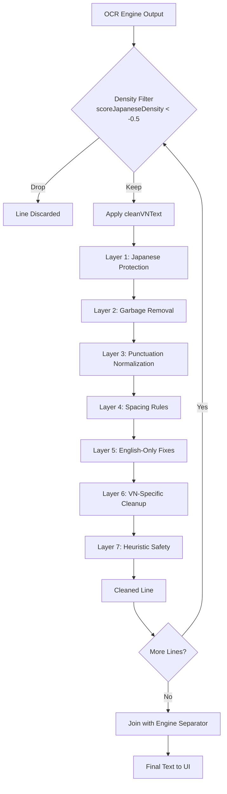

# VN-Optimized Japanese Text Validator – Implementation Plan

## Phase 1: Create Validator Module
- [ ] Create `js/utils/text_validator.js`
- [ ] Define Japanese character ranges (Unicode) as constants
- [ ] Implement `scoreJapaneseDensity` with extended ranges
- [ ] Implement `cleanVNText` with eight layers:
  1. **Japanese Character Protection** – detect and mark protected ranges
  2. **Garbage Character Removal** – regex patterns for isolated garbage, UI artifacts
  3. **Punctuation Normalization** – collapse duplicates, normalize mixed punctuation
  4. **Spacing Rules** – remove spaces inside Japanese, insert JP‑Latin space, collapse spaces, remove space before punctuation
  5. **English‑Only OCR Fixes** – safe substitutions on ASCII‑only segments
  6. **VN‑Specific Cleanup** – remove UI artifacts, stray ASCII, trailing punctuation clusters, leading garbage
  7. **Heuristic Safety** – classify line composition and adjust intensity
  8. **Final Trim**
- [ ] Implement `applyVNValidator(lines, separator)` that filters by density and cleans each line
- [ ] Export functions for use elsewhere

## Phase 2: Integrate into Engine Post‑Processing
- [ ] Open `app.js`
- [ ] Locate the `engines` object (around line 225)
- [ ] Update each engine's `postprocess` property:
  - **PaddleOCR**: replace with `(results) => applyVNValidator(results, '\n')`
  - **Tesseract**: replace with `(results) => applyVNValidator(results, ' ')`
  - **MangaOCR**: replace with `(results) => applyVNValidator(results, '')`
- [ ] Ensure the existing density filter is retained (already inside `applyVNValidator`)
- [ ] Verify no other engine‑specific post‑processing is lost

## Phase 3: Update UI Whitespace Handling
- [ ] In `app.js`, locate `addOCRResultToUI` function (around line 1543)
- [ ] Replace `const clean = text.replace(/\s+/g, '').trim();` with `const clean = cleanVNText(text);`
- [ ] Ensure the confidence suffix is still appended after cleaning
- [ ] Check that empty lines are still filtered out

## Phase 4: Testing & Validation
- [ ] Create a test page `test_validator.html` that loads the validator module and runs test cases
- [ ] Collect real OCR samples from visual novels (using the app's debug output)
- [ ] Define expected outputs for each sample
- [ ] Run automated tests in browser console
- [ ] Verify:
  - Japanese text remains unchanged
  - Garbage is removed
  - Punctuation normalized correctly
  - Spacing rules applied
  - English‑only fixes applied only where safe
  - No regressions in existing OCR pipeline
- [ ] Perform integration test: run OCR on a known VN screenshot and compare before/after validator

## Phase 5: Deployment & Monitoring
- [ ] Increment version number in `app.js` (VNOCR_BUILD)
- [ ] Update `service-worker.js` version if needed
- [ ] Deploy to production (if applicable)
- [ ] Monitor console for any unexpected errors
- [ ] Gather user feedback on improved readability

## Workflow Diagram

## Risk Mitigation
- **Japanese Character Corruption**: Use protective masking; test extensively with Japanese‑only text.
- **Performance**: Profile cleaning on long lines; ensure operations are O(n).
- **Regression**: Keep existing density filter; compare outputs before/after integration.
- **Browser Compatibility**: Use ES5‑compatible regex; avoid latest ECMAScript features.

## Success Criteria
1. Validator module passes all unit tests.
2. OCR results show improved readability (subjective).
3. No introduced bugs in existing OCR pipeline.
4. Japanese text integrity maintained (zero modifications).
5. Garbage lines removed effectively.

## Timeline
- Phase 1: 1 day
- Phase 2: 0.5 day
- Phase 3: 0.5 day
- Phase 4: 1 day
- Phase 5: 0.5 day

Total estimated effort: 3.5 days.

## Next Steps
Present this plan to the user for approval, then switch to Code mode for implementation.